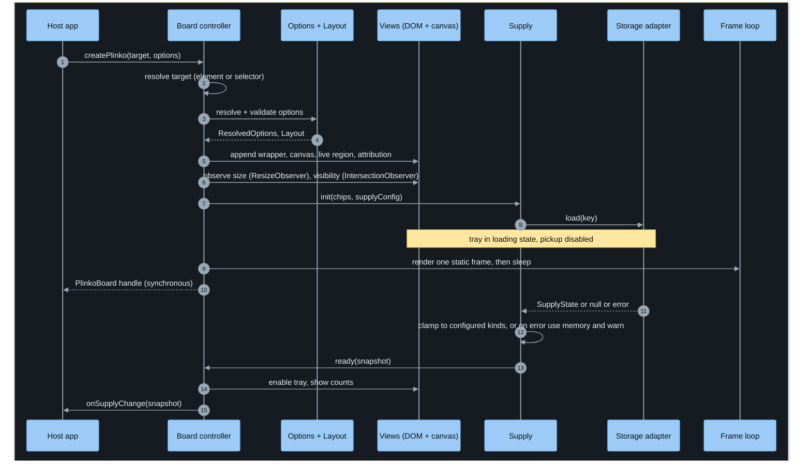
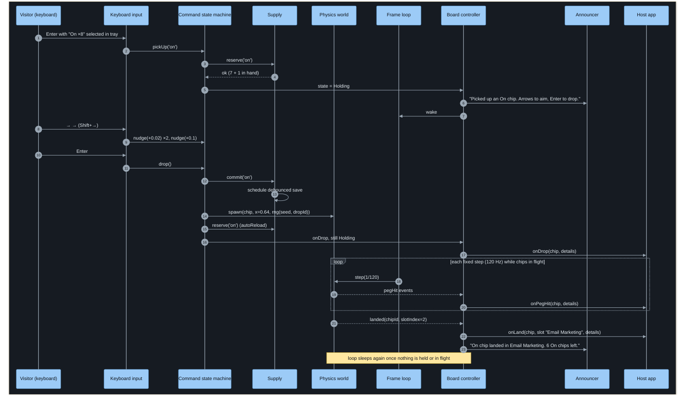

# plinko-config: Architecture

> Diagrams are [Mermaid](https://mermaid.js.org/) and render on GitHub and in VS Code (with a Mermaid preview extension).
> C4 levels are drawn as styled flowcharts rather than Mermaid's experimental `C4Context` syntax, which lays out poorly.

**Contents**

1. [C4 Level 1: System Context](#1-c4-level-1-system-context)
2. [C4 Level 2: Containers](#2-c4-level-2-containers)
3. [C4 Level 3: Components](#3-c4-level-3-components)
4. [Data flow](#4-data-flow)
5. [Held-chip state machine](#5-held-chip-state-machine)
6. [Chip lifecycle](#6-chip-lifecycle)
7. [Dynamic: mount and supply load](#7-dynamic-mount-and-supply-load)
8. [Dynamic: keyboard drop to landing](#8-dynamic-keyboard-drop-to-landing)
9. [Dynamic: the frame loop](#9-dynamic-the-frame-loop)
10. [Architectural rules](#10-architectural-rules)

---

## 1. C4 Level 1: System Context

**Legend:** $\color{#0b3d6e}{\blacksquare}$ person · $\color{#1565c0}{\blacksquare}$ software system · $\color{#4b5563}{\blacksquare}$ external system / data store · ┆ dashed box = boundary · ┄▸ dotted arrow = optional

```mermaid
%%{init: {"theme":"base","themeVariables":{"lineColor":"#9aa7b4","textColor":"#e6edf3","primaryTextColor":"#e6edf3","edgeLabelBackground":"#2d333b","clusterBkg":"#161b22","clusterBorder":"#30363d","titleColor":"#e6edf3"}}}%%
flowchart TB
    subgraph canvas[" "]
        direction TB


        visitor["<b>Site visitor</b><br/><i>[Person]</i><br/>Sets preferences by dropping chips,<br/>by keyboard or pointer"]:::person
        dev["<b>Host developer</b><br/><i>[Person]</i><br/>Installs, configures, and<br/>handles landings"]:::person

        subgraph hostBoundary["Host web application"]
            plinko["<b>plinko-config</b><br/><i>[Software system: npm library]</i><br/>Plinko board UI: physics, rendering,<br/>input, accessibility, chip supply"]:::system
        end

        storage[("<b>Browser storage</b><br/><i>[External]</i><br/>localStorage / sessionStorage / cookies")]:::external
        backend["<b>Host backend API</b><br/><i>[External, optional]</i><br/>Persists preferences and/or chip supply"]:::external
        at["<b>Assistive technology</b><br/><i>[External]</i><br/>Screen readers"]:::external

        visitor -- "picks up, aims, drops chips" --> plinko
        dev -- "configures options and callbacks" --> plinko
        plinko -- "onLand(chip, slot): host applies preference" --> backend
        plinko -- "reads/writes chip supply" --> storage
        plinko -. "custom StorageAdapter" .-> backend
        plinko -- "live-region announcements" --> at
        at -- "speaks" --> visitor
    end

    classDef person fill:#0b3d6e,stroke:#5b9bd5,color:#ffffff
    classDef system fill:#1565c0,stroke:#90caf9,color:#ffffff
    classDef external fill:#4b5563,stroke:#9ca3af,color:#ffffff
    style canvas fill:#161b22,stroke:#161b22
    style hostBoundary fill:#161b22,stroke:#5b9bd5,stroke-dasharray:5 5,color:#e6edf3
```

**Notes**

- The library never persists *preferences*. The host does that in `onLand`. The library only persists its own *chip supply*.

---

## 2. C4 Level 2: Containers

**Legend:** $\color{#0b3d6e}{\blacksquare}$ person · $\color{#1f5f99}{\blacksquare}$ container (ours) · $\color{#4b5563}{\blacksquare}$ external container / data store · ┆ dashed box = boundary · ┄▸ dotted arrow = optional

```mermaid
%%{init: {"theme":"base","themeVariables":{"lineColor":"#9aa7b4","textColor":"#e6edf3","primaryTextColor":"#e6edf3","edgeLabelBackground":"#2d333b","clusterBkg":"#161b22","clusterBorder":"#30363d","titleColor":"#e6edf3"}}}%%
flowchart TB
    subgraph canvas[" "]
        direction TB

        dev["<b>Host developer</b><br/><i>[Person]</i>"]:::person
        visitor["<b>Site visitor</b><br/><i>[Person]</i>"]:::person

        subgraph browser["Browser tab"]
            hostApp["<b>Host app code</b><br/><i>[Container: JS, any framework]</i><br/>Solid / React / Angular / plain HTML.<br/>Owns preference state."]:::external

            subgraph pkg["plinko-config package"]
                element["<b>plinko-config/element</b><br/><i>[Container: ES module]</i><br/>&lt;plinko-board&gt; Web Component.<br/>Properties in, CustomEvents out."]:::container
                core["<b>plinko-config</b><br/><i>[Container: ES module, ≤12 KB gz]</i><br/>createPlinko(), presets,<br/>runtime + pure core"]:::container
            end

            dom["<b>Host DOM subtree</b><br/><i>[Container: DOM]</i><br/>Mount target element. Library appends<br/>one wrapper: canvas, live region,<br/>attribution link"]:::external
            storage[("<b>Web Storage / cookies</b><br/><i>[Container: browser store]</i>")]:::external
        end

        backend["<b>Host backend API</b><br/><i>[External, optional]</i>"]:::external

        dev -- "npm install, import" --> hostApp
        hostApp -- "el.options ⇄<br/>plinko-* events" --> element
        hostApp <-- "createPlinko · update · destroy<br/>⇄ onLand(chip, slot) callbacks" --> core
        element -- "wraps" --> core
        visitor -- "keyboard / pointer" --> dom
        core -- "renders into own wrapper" --> dom
        core -- "supply load / save" --> storage
        hostApp -- "save preferences" --> backend
        core -. "custom StorageAdapter" .-> backend
    end

    classDef person fill:#0b3d6e,stroke:#5b9bd5,color:#ffffff
    classDef container fill:#1f5f99,stroke:#90caf9,color:#ffffff
    classDef external fill:#4b5563,stroke:#9ca3af,color:#ffffff
    style canvas fill:#161b22,stroke:#161b22
    style browser fill:#161b22,stroke:#9ca3af,stroke-dasharray:5 5,color:#e6edf3
    style pkg fill:#14273d,stroke:#5b9bd5,stroke-width:2px,color:#e6edf3
```

**Notes**

- **Two entry points.** `plinko-config` has no side effects on import. `plinko-config/element` registers `<plinko-board>` when imported, and it's the only entry listed in `sideEffects`.
- **The DOM boundary is strict.** The library appends exactly one wrapper inside the target, attaches listeners only to its own nodes, and removes everything on `destroy()`.
- No runtime dependencies and no peer dependencies.

---

## 3. C4 Level 3: Components

**Legend:** $\color{#9ccbf7}{\blacksquare}$ component · $\color{#4b5563}{\blacksquare}$ external / data store · $\color{#5b9bd5}{\square}$ runtime group, blue outline (touches DOM) · $\color{#56a35a}{\square}$ core group, green outline (pure TS) · → call / data · ┄▸ event up from core

```mermaid
%%{init: {"theme":"base","themeVariables":{"lineColor":"#9aa7b4","textColor":"#e6edf3","primaryTextColor":"#e6edf3","edgeLabelBackground":"#2d333b","clusterBkg":"#161b22","clusterBorder":"#30363d","titleColor":"#e6edf3"}}}%%
flowchart TB
    subgraph canvas[" "]
        direction TB


        hostApp["<b>Host app / &lt;plinko-board&gt;</b><br/><i>[Caller]</i>"]:::external
        domIn["<b>DOM events</b><br/><i>[Browser]</i><br/>keydown, pointer*"]:::external

        subgraph runtime["Runtime: DOM-aware"]
            direction TB
            subgraph inputs[" "]
                direction LR
                kb["<b>Keyboard input</b><br/><i>input/keyboard.ts</i><br/>key → command"]:::comp
                ptr["<b>Pointer input</b><br/><i>input/pointer.ts</i><br/>drag/click → command"]:::comp
            end
            cmds["<b>Command state machine</b><br/><i>commands.ts</i><br/>pickUp · aim · nudge · drop · cancel"]:::comp
            board["<b>Board controller</b><br/><i>board.ts</i><br/>createPlinko(); public handle;<br/>wiring; host callbacks"]:::comp
            loop["<b>Frame loop</b><br/><i>loop.ts</i><br/>RAF + 120 Hz fixed step;<br/>idle sleep; visibility pause"]:::comp
            subgraph views[" "]
                direction LR
                canvasView["<b>Canvas view</b><br/><i>view/canvas.ts</i><br/>pegs, slots, chips, piles, tray"]:::comp
                domView["<b>DOM view</b><br/><i>view/dom.ts</i><br/>wrapper, attribution link"]:::comp
                a11y["<b>Announcer</b><br/><i>view/a11y.ts</i><br/>live region"]:::comp
            end
        end

        domOut["<b>DOM output</b><br/><i>[Browser]</i><br/>wrapper subtree"]:::external

        subgraph core["Core: pure TypeScript"]
            direction LR
            opts["<b>Options resolver</b><br/><i>options.ts</i>"]:::comp
            layout["<b>Layout</b><br/><i>layout.ts</i>"]:::comp
            world["<b>Physics world</b><br/><i>world.ts</i><br/>step; spatial hash;<br/>landing + stuck detection"]:::comp
            rng["<b>Seeded RNG</b><br/><i>rng.ts</i>"]:::comp
            vendor["<b>Vendored LittleJS</b><br/><i>vendor/littlejs</i>"]:::comp
            supply["<b>Supply</b><br/><i>supply.ts</i><br/>reserve / commit / release;<br/>refill policies"]:::comp
            storage["<b>Storage adapters</b><br/><i>storage.ts</i>"]:::comp
        end

        storeExt[("<b>Storage backend</b><br/><i>[Browser / host API]</i>")]:::external

        hostApp <-- "options, handle calls ⇄ callbacks" --> board
        domIn --> kb
        domIn --> ptr
        kb -- "Command" --> cmds
        ptr -- "Command" --> cmds
        board <-- "programmatic commands ⇄ state changes" --> cmds
        board -- "start / wake" --> loop
        board --> domView
        board --> a11y
        loop -- "render(state, α)" --> canvasView
        canvasView --> domOut
        domView --> domOut
        a11y --> domOut

        board -- "resolve" --> opts
        opts --> layout --> world
        cmds -- "spawn" --> world
        cmds -- "reserve / commit / release" --> supply
        loop -- "step × n" --> world
        world -. "pegHit, landed, missed, full" .-> board
        supply -. "onSupplyChange" .-> board
        world --> rng
        world --> vendor
        supply -- "load / save" --> storage --> storeExt
    end

    classDef comp fill:#9ccbf7,stroke:#5b9bd5,color:#0d1117
    classDef external fill:#4b5563,stroke:#9ca3af,color:#ffffff
    style canvas fill:#161b22,stroke:#161b22
    style runtime fill:#14273d,stroke:#5b9bd5,color:#e6edf3
    style core fill:#16301f,stroke:#56a35a,color:#e6edf3
    style inputs fill:#14273d,stroke:#14273d
    style views fill:#14273d,stroke:#14273d
```

**Component responsibilities**

| Component | Owns | Never does |
|---|---|---|
| Board controller | Lifecycle, wiring, public handle, invoking host callbacks (wrapped in try/catch) | Physics math, drawing |
| Command state machine | The *only* path that changes held/in-flight state; enforces `maxInFlight` and supply | Read the DOM or keys directly |
| Keyboard / Pointer input | Translating raw events into commands | Change state directly |
| Frame loop | Time: RAF, accumulator, sleep/wake, visibility | Know what chips are |
| Canvas / DOM views | Pixels and nodes, derived from state | Mutate state |
| Announcer | Wording (via `labels`) and throttling | Decide *when* something happened |
| Physics world | Bodies, collisions, events | Know about supply, DOM, or callbacks |
| Supply | Counts and policies | Know where it's stored |
| Storage adapters | I/O and failure fallback | Interpret counts |

---

## 4. Data flow

The flow is split into two diagrams that share data stores D1–D4.

### 4a. Setup and interaction (event-driven)

**Legend:** $\color{#9ccbf7}{\blacksquare}$ process · $\color{#ffe7a0}{\blacksquare}$ data store · $\color{#4b5563}{\blacksquare}$ external entity / store · → data flow · ┄▸ config read

```mermaid
%%{init: {"theme":"base","themeVariables":{"lineColor":"#9aa7b4","textColor":"#e6edf3","primaryTextColor":"#e6edf3","edgeLabelBackground":"#2d333b","clusterBkg":"#161b22","clusterBorder":"#30363d","titleColor":"#e6edf3"}}}%%
flowchart TB
    subgraph canvas[" "]
        direction TB


        H["Host app"]:::external
        U["Site visitor"]:::external
        S[("Browser storage /<br/>host API")]:::external

        P1(["1 · Resolve options"]):::proc
        P2(["2 · Build layout"]):::proc
        P3(["3 · Interpret input"]):::proc
        P4(["4 · Apply command"]):::proc
        P9(["9 · Manage supply"]):::proc

        D1[("D1 · ResolvedOptions")]:::store
        D2[("D2 · Layout geometry<br/>pegs, walls, slots")]:::store
        D3[("D3 · Board state<br/>held chip, aim x, chips in flight")]:::store
        D4[("D4 · Supply state<br/>counts, reserved, lastRefillAt")]:::store

        H -- "PlinkoOptions" --> P1
        P1 --> D1
        D1 --> P2
        P2 --> D2

        U -- "key / pointer events" --> P3
        D1 -. "KeyBindings" .-> P3
        P3 -- "Command" --> P4
        H -- "handle calls:<br/>pickUp / drop / cancel" --> P4

        P4 -- "reserve / commit / release" --> P9
        P9 --> D4
        P9 <-- "SupplyState<br/>load · debounced save" --> S
        P9 -- "onSupplyChange, onExhausted" --> H

        P4 -- "held chip, aim x,<br/>spawned ChipBody" --> D3
    end

    classDef proc fill:#9ccbf7,stroke:#5b9bd5,color:#0d1117
    classDef store fill:#ffe7a0,stroke:#c9a227,color:#0d1117
    classDef external fill:#4b5563,stroke:#9ca3af,color:#ffffff
    style canvas fill:#161b22,stroke:#161b22
```

### 4b. Per frame: simulation and output (time-driven)

**Legend:** $\color{#9ccbf7}{\blacksquare}$ process · $\color{#ffe7a0}{\blacksquare}$ data store · $\color{#4b5563}{\blacksquare}$ external entity · → data flow

```mermaid
%%{init: {"theme":"base","themeVariables":{"lineColor":"#9aa7b4","textColor":"#e6edf3","primaryTextColor":"#e6edf3","edgeLabelBackground":"#2d333b","clusterBkg":"#161b22","clusterBorder":"#30363d","titleColor":"#e6edf3"}}}%%
flowchart TB
    subgraph canvas[" "]
        direction TB


        D2[("D2 · Layout geometry")]:::store
        D3[("D3 · Board state")]:::store
        D4[("D4 · Supply state")]:::store

        P5(["5 · Simulate<br/>fixed 120 Hz steps"]):::proc
        P6(["6 · Detect landing<br/>or miss"]):::proc
        P7(["7 · Render"]):::proc
        P8(["8 · Announce"]):::proc

        H["Host app"]:::external
        U["Site visitor<br/>(eyes + screen reader)"]:::external

        D2 -- "pegs, walls" --> P5
        D3 -- "positions, velocities" --> P5
        P5 -- "updated bodies" --> D3
        P5 -- "pegHit events" --> H

        D3 --> P6
        D2 -- "slot bounds" --> P6
        P6 -- "freeze chip into pile" --> D3
        P6 -- "onLand (valid landing only)<br/>onMiss" --> H
        P6 -- "landed / missed / full" --> P8

        D2 --> P7
        D3 -- "bodies, held chip" --> P7
        D4 -- "tray counts" --> P7
        P7 -- "canvas pixels" --> U

        P8 -- "live-region text" --> U
    end

    classDef proc fill:#9ccbf7,stroke:#5b9bd5,color:#0d1117
    classDef store fill:#ffe7a0,stroke:#c9a227,color:#0d1117
    classDef external fill:#4b5563,stroke:#9ca3af,color:#ffffff
    style canvas fill:#161b22,stroke:#161b22
```

P8 (announce) also receives "picked up / dropped / cancelled" from P4 and "low / exhausted / refilled" from P9. Those flows are left off both diagrams to keep them readable.

**Key data shapes**

| Data | Shape | Producer → consumer |
|---|---|---|
| `Command` | `{type:'pickUp', kind} \| {type:'aim', x} \| {type:'nudge', dx} \| {type:'drop'} \| {type:'cancel'}` | Input / handle → state machine |
| `ChipBody` | `{ id, kindId, dropX, seed, rng, pos, vel, pegHits, ageSteps, stillSteps, nudges, onPile, outcome?, slotIndex? }` | World ↔ board state |
| `WorldEvent` | `{type:'pegHit', chip, pegIndex, speed} \| {type:'landed', chip, slotIndex} \| {type:'missed', chip} \| {type:'full', reason:'slots'\|'overflow'}` | World → controller |
| `Landing` | `{ chip, slot, details: { dropId, dropX, pegHits, durationMs, seed } }` | Controller → host, announcer |
| `SupplyState` | `{ v:1, counts, lastRefillAt? }` | Supply ↔ storage |

**Trust boundaries**

- Host options are validated once, in P1. Bad config throws a descriptive error at `createPlinko`, never mid-game.
- Storage data is untrusted: parsed defensively and clamped against the configured kinds in P9.
- Host callbacks are untrusted code: wrapped in try/catch, and errors are logged so a broken `onLand` can't freeze the board.

---

## 5. Held-chip state machine

One machine per board. Keyboard, pointer, and handle calls all feed it. In-flight chips are independent of it, which is what makes rapid fire work.

**Legend:** $\color{#e6edf3}{\blacksquare}$ start · $\color{#d2a8ff}{\blacksquare}$ state · $\color{#ffe7a0}{\blacksquare}$ choice · → event / guard

```mermaid
%%{init: {"theme":"base","themeVariables":{"lineColor":"#9aa7b4","textColor":"#e6edf3","primaryTextColor":"#e6edf3","edgeLabelBackground":"#2d333b","clusterBkg":"#161b22","clusterBorder":"#30363d","titleColor":"#e6edf3"}}}%%
flowchart TB
    subgraph canvas[" "]
        direction TB


        start((" ")):::start -- "mount" --> Loading(["Loading"]):::state
        Loading -- "supply loaded" --> Idle(["Idle"]):::state
        Idle -- "pickUp(kind)" --> canPick{"reserve?"}:::choice
        canPick -- "ok" --> Holding(["Holding"]):::state
        canPick -- "none left" --> Idle
        Holding -- "aim / nudge" --> Holding
        Holding -- "cancel" --> Idle
        Holding -- "drop" --> Dropping(["Dropping"]):::state
        Dropping -- "commit + spawn" --> reload{"reload?"}:::choice
        reload -- "autoReload and reserve ok" --> Holding
        reload -- "otherwise" --> Idle
    end

    classDef start fill:#e6edf3,stroke:#e6edf3,color:#0d1117
    classDef state fill:#d2a8ff,stroke:#a371f7,color:#0d1117
    classDef choice fill:#ffe7a0,stroke:#c9a227,color:#0d1117
    style canvas fill:#161b22,stroke:#161b22
```

| Transition | Guard / side effects |
|---|---|
| `Idle → Holding` | `supply.reserve(kind)` succeeds. Announce pickup. Keyboard zone moves to the board. |
| `Idle → Idle` (none left) | Announce "Out of *kind* chips." If `refill: 'onRequest'`, the tray offers a "request more chips" action. |
| `Holding → Holding` | `aim(x)` / `nudge(dx)`, clamped to the board's drop range. |
| `Holding → Idle` (cancel) | `Esc`, or pointer released off the board. `supply.release`. Keyboard zone returns to the tray. |
| `Holding → Dropping` | Only if `inFlight < maxInFlight`; otherwise stay in `Holding` and announce "wait." |
| `Dropping → …` | Commit the reservation, spawn the chip in the world, fire `onDrop`. With `autoReload`, reserve the next chip of the same kind at the same x. |
| any → destroyed | `destroy()`: release any reservation, flush saves, tear down. |

The canvas is a single tab stop. Inside it, a *keyboard zone* (tray or board) is tracked separately from this machine. It only decides how keys are interpreted: tray keys select a kind and produce `pickUp`, and board keys produce `aim`/`nudge`/`drop`/`cancel`.

**Invariants**

- At most one *held* chip. Any number of *in-flight* chips (up to `maxInFlight`).
- A reservation exists if and only if the state is `Holding`.
- `destroy()` from any state releases reservations and flushes pending supply saves.

---

## 6. Chip lifecycle

A single chip, from the tray to the pile.

**Legend:** $\color{#e6edf3}{\blacksquare}$ start / end · $\color{#d2a8ff}{\blacksquare}$ state · → event

```mermaid
%%{init: {"theme":"base","themeVariables":{"lineColor":"#9aa7b4","textColor":"#e6edf3","primaryTextColor":"#e6edf3","edgeLabelBackground":"#2d333b","clusterBkg":"#161b22","clusterBorder":"#30363d","titleColor":"#e6edf3"}}}%%
flowchart LR
    subgraph canvas[" "]
        direction LR


        start((" ")):::start --> InTray(["In tray"]):::state
        InTray -- "pickUp" --> Reserved(["Reserved"]):::state
        Reserved -- "cancel (release)" --> InTray
        Reserved -- "drop (commit, spawn)" --> InFlight(["In flight"]):::state
        InFlight -- "step: gravity, collisions,<br/>pegHit, safety-net nudge" --> InFlight
        InFlight -- "at rest, partly<br/>below rail tops" --> Landed(["Landed"]):::state
        InFlight -- "at rest on pile above rails,<br/>or 60 s failsafe" --> Missed(["Missed"]):::state
        Landed -- "onLand fired,<br/>frozen as static collider" --> Resting(["Resting in pile"]):::state
        Missed -- "onMiss fired (no onLand),<br/>frozen as static collider" --> Resting
        Resting -- "destroy()" --> done(((" "))):::start
    end

    classDef start fill:#e6edf3,stroke:#e6edf3,color:#0d1117
    classDef state fill:#d2a8ff,stroke:#a371f7,color:#0d1117
    style canvas fill:#161b22,stroke:#161b22
```

- **The layout is jam-free.** Every row leaves either a chip-sized gap or none. A peg too close to a wall for a chip to pass becomes a half-round bump set into the wall, which also stops chips sliding straight down the walls. Slot dividers are rails with rounded tops.
- **Round things are unstable to rest on.** A chip resting on a peg, rail cap, wall bump, or piled chip gets a small push away from its centre, so it rolls off. Nudging a still chip is only a safety net; a chip deliberately stuck on a peg is a planned prank, never a physics side effect.
- **A landing is a real slot result.** A chip counts as *landed* when it is at rest with any part below the rail tops; the slot comes from its x position, so a chip that rolls off an overflowing pile reports the slot it actually ends up in. Anything else that settles (on a pile above the rails, or the 60 s failsafe) is a *miss*: it uses up the chip but never fires `onLand`, so hosts never filter landings.
- **Settled chips pile up, forever.** Landed and missed chips freeze as static colliders, and later chips stack on them. Piles are only cleared by `destroy()`. When a pile rises above its rails, new chips roll over into the neighbouring slots.
- **The board fills up.** The world emits `full` once: `slots` when every slot's pile reaches the rail tops, or `overflow` when a chip settles with any part at or above the drop line. The board then locks: no more drops, and a message that no more changes can be made.

---

## 7. Dynamic: mount and supply load

**Legend:** $\color{#9ccbf7}{\blacksquare}$ participant · $\color{#ffe7a0}{\blacksquare}$ note · → call / message · ⇢ return / async result · ① step order

`createPlinko` returns synchronously even when the storage adapter is async, so host code stays simple. Readiness shows up through the tray and `onSupplyChange`.

---

## 8. Dynamic: keyboard drop to landing

**Legend:** $\color{#9ccbf7}{\blacksquare}$ participant · $\color{#ffe7a0}{\blacksquare}$ note · → call / message · ⇢ return / event · ① step order · `loop` frame = repeated block

---

## 9. Dynamic: the frame loop

**Legend:** $\color{#e6edf3}{\blacksquare}$ entry / exit · $\color{#9ccbf7}{\blacksquare}$ step · $\color{#ffe7a0}{\blacksquare}$ decision · → control flow

```mermaid
%%{init: {"theme":"base","themeVariables":{"lineColor":"#9aa7b4","textColor":"#e6edf3","primaryTextColor":"#e6edf3","edgeLabelBackground":"#2d333b","clusterBkg":"#161b22","clusterBorder":"#30363d","titleColor":"#e6edf3"}}}%%
flowchart TB
    subgraph canvas[" "]
        direction TB


        start(["requestAnimationFrame(now)"]):::term --> vis{"board visible and<br/>tab not hidden?"}:::choice
        vis -- no --> park(["park: resume on visibility change"]):::term
        vis -- yes --> acc["acc += min(now - last, 250 ms)"]:::step
        acc --> step{"acc ≥ 1/120 s?"}:::choice
        step -- yes --> sim["world.step(1/120)<br/>collect events<br/>acc -= 1/120"]:::step
        sim --> step
        step -- no --> ev["dispatch collected events:<br/>pegHit, landed, missed, full →<br/>callbacks + announcer"]:::step
        ev --> draw["canvas.render(state, alpha = acc / dt)<br/>interpolate positions"]:::step
        draw --> idle{"anything held<br/>or in flight?"}:::choice
        idle -- yes --> start
        idle -- no --> sleep(["sleep: no RAF until next command"]):::term
    end

    classDef term fill:#e6edf3,stroke:#9aa7b4,color:#0d1117
    classDef step fill:#9ccbf7,stroke:#5b9bd5,color:#0d1117
    classDef choice fill:#ffe7a0,stroke:#c9a227,color:#0d1117
    style canvas fill:#161b22,stroke:#161b22
```

- The **250 ms clamp** stops a "spiral of death" after a background tab returns.
- **Events are dispatched after stepping**, not during, so host callbacks can't run in the middle of a physics step (e.g. calling `board.update()` from inside `onLand`).
- **Interpolation** (`alpha`) keeps motion smooth on 60, 120, and 144 Hz displays while the simulation stays at a fixed 120 Hz.

---

## 10. Architectural rules

1. **Core never imports Runtime.** Enforced by a lint rule (`no-restricted-imports`) and by running core tests in plain Node with no DOM.
2. **Only the command state machine mutates held and in-flight state.** Inputs and handle methods go through it, so keyboard, pointer, and scripted use behave the same.
3. **Views are derived.** They read state and never write it.
4. **Host callbacks run outside the physics step**, wrapped in try/catch.
5. **No global side effects.** No `window`/`document` listeners, no global styles (styles are scoped to the wrapper), nothing at import time except in `element.js`.
6. **`destroy()` is total.** It cancels RAF, disconnects observers, removes listeners and nodes, releases reservations, and flushes saves. Calling it twice is safe.
