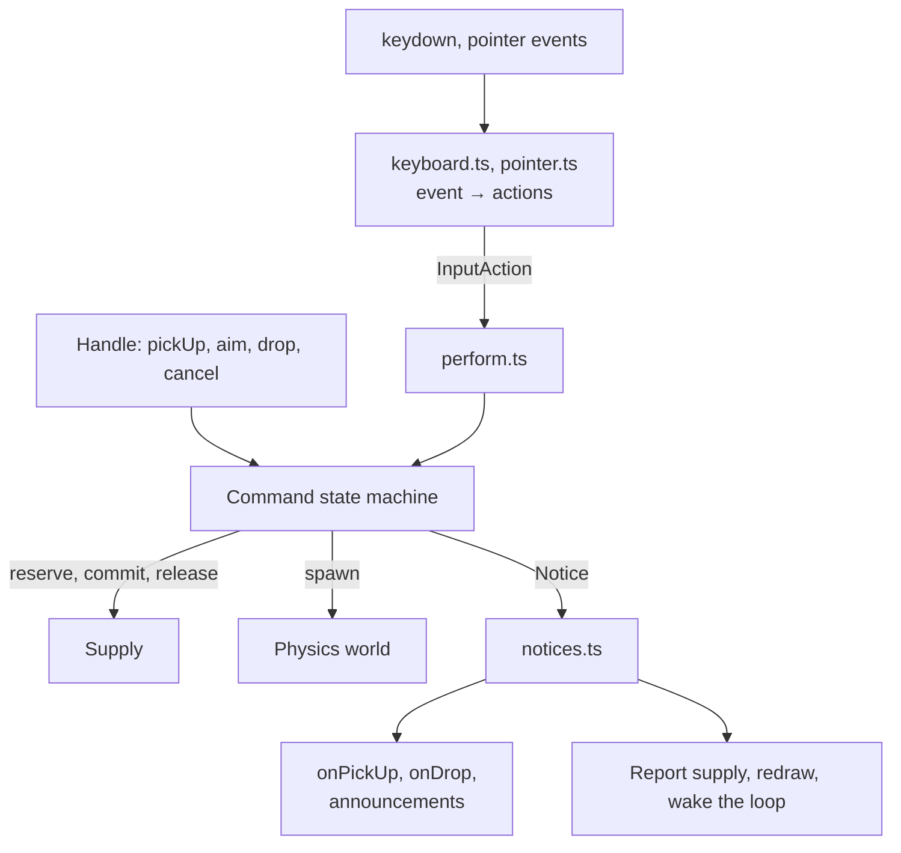
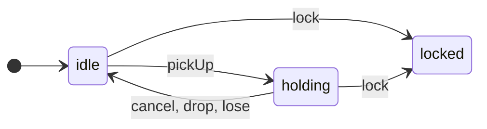
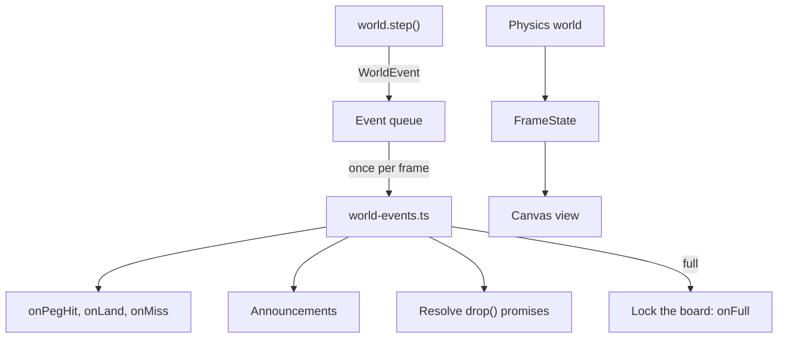

# Data flow

Data moves through a board along three paths. Input from visitors and handle calls goes through the command state machine. Physics events come out of the frame loop. Supply changes come from the machine, the refill timer, and requests for more chips. Each path ends the same way: callbacks to the host, announcements, and a redraw.

## Input

`keyboard.ts` and `pointer.ts` are pure: they turn a key or a gesture, plus whether a chip is held, into `InputAction`s. The canvas view says what a point is over (`hitTest`). `perform.ts` applies the actions, as calls on the state machine; while the board is locked it ignores them.

Handle calls skip the input layer and call the machine directly. `drop()` asks the machine to carry the chip into the drop zone first, so scripted drops are never lost.

The machine calls out through ports, never directly: `reserve`, `commit`, and `release` on the supply, `spawn` on the world, and `inFlight` to check `maxInFlight`. After each change, it emits a `Notice`, and `notices.ts` fires callbacks and announcements. Then the board reports the supply (after a notice that can change counts) and redraws.

## The state machine

| Call | Supply | World |
|---|---|---|
| `pickUp` | reserve | |
| `cancel` | release | |
| `drop` in the drop zone | commit (and reserve again, with reload) | spawn |
| `drop` outside the drop zone, or `lose` | commit | |
| `lock` while holding | release | |

`aim`, `nudge`, `lift`, and `liftTo` move the held chip without leaving `holding`, and so does a drop with reload, which picks up the next chip straight away. `destroy()` moves any state to a fourth state, `destroyed`, releasing a held chip's reservation. A reservation exists exactly while the state is `holding`. Chips in flight belong to the world, not the machine, so the machine is back in `idle` (or `holding`, after a reload) as soon as a chip drops. That's what allows rapid fire.

A drop is refused, with a `busy` notice, while `maxInFlight` chips are in flight.

## Physics

The frame loop steps the world, and each step returns `WorldEvent`s. They're queued and dispatched once per frame, after stepping; see [Frame loop](./frame-loop#events-after-stepping). Then the canvas view draws a `FrameState`: a snapshot of the chips in flight, the piles, the held chip, the tray counts, and what's lit.

## Supply

Chip counts change when the machine reserves, commits, or releases a chip, when the refill timer adds one, when a request is granted, and when the host calls `board.supply.set()` or `add()`. After each change, `supplyChanged()` (`src/runtime/supply.ts`) does three things:

1. Calls `onSupplyChange`, if the counts differ from the last report.
2. Locks the board if the supply is exhausted.
3. Redraws.

A request for more chips calls `onRequest` and waits for the answer. While it waits, the tray shows that a request is pending, and asking again for the same kind waits for the same answer.

## Messages

| Message | Defined in | From → to |
|---|---|---|
| `InputAction` | `input/actions.ts` | Keyboard and pointer → `perform.ts` |
| `Notice` | `commands.ts` | State machine → `notices.ts` |
| `WorldEvent` | `core/world.ts` | Physics world → `world-events.ts` |
| `FrameState` | `view/canvas.ts` | Frame loop → canvas view |
| `SupplySnapshot` | `core/supply.ts` | Supply → host (`onSupplyChange`) |

Each union of messages has a "by type" interface (`InputActionByType`, `NoticeByType`, `WorldEventByType`), and is handled with `dispatchByType()` (`dispatch.ts`). A new message type without a handler doesn't compile.
