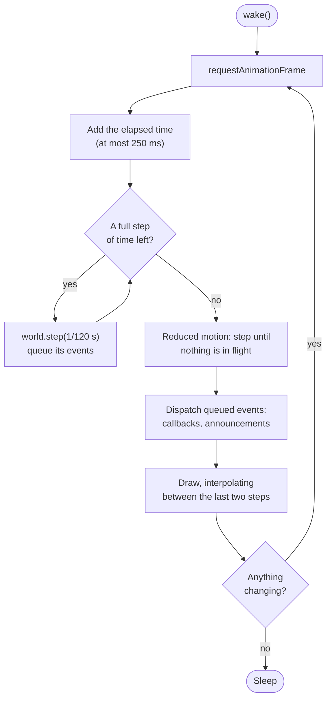

# Frame loop

Each board has one frame loop. It runs on `requestAnimationFrame` only while something on the board is changing, steps the physics at a fixed 120 Hz whatever the display's refresh rate, and draws once per frame.

## Waking and sleeping

The loop requests frames only while something changes: a chip in flight, a lost chip falling off the board, events waiting to be dispatched, or a peg still lit from a hit. Once none of those is left, it stops requesting frames and resets its time.

Commands such as a pickup or a drop call `wake()`, which is safe to call at any time. A resize or theme change while the loop is asleep draws one frame without stepping.

## Fixed steps

The physics world advances in fixed steps of 1/120 s. Each frame adds the elapsed time to an accumulator and runs as many whole steps as fit. The rest carries over to the next frame.

Elapsed time is capped at 250 ms per frame. Browsers stop sending frames to hidden tabs, and without the cap, a tab coming back after a minute would run thousands of steps at once.

## Events after stepping

`world.step()` returns what happened during that step (peg hits, landings, misses, a full board), and the loop queues it. The queue is dispatched once per frame, after all of that frame's steps. Host callbacks therefore never run in the middle of a physics step, so a callback can safely call back into the board, for example `board.update()` from inside `onLand`.

## Interpolation

Drawing happens between steps. The leftover time in the accumulator, as a fraction of a step, tells the canvas how far to interpolate each chip between its previous and current position. Motion stays smooth on 60, 120, and 144 Hz displays.

## Pausing

The loop pauses while the board is scrolled out of view (an `IntersectionObserver` on the wrapper) or after the host calls `board.pause()`, and resumes when neither applies.

## Reduced motion

With reduced motion, the frame after a drop runs the world's fixed steps until no chip is in flight, then dispatches the events as usual. The steps are the same as for the animated fall, so a seeded drop lands in the same slot either way. The settling is capped at 90 s of steps, longer than the world's 60 s limit on a single fall.

It runs in a frame, never inside `drop()`, so `onDrop` fires and the `drop()` promise exists before `onLand`.

## Where it lives

| File | Does |
|---|---|
| `src/runtime/loop.ts` | `FrameLoop`: timing, the accumulator, sleep and pause. Knows nothing about chips. |
| `src/runtime/frame.ts` | The loop's callbacks: step the world, settle under reduced motion, dispatch events, build the frame to draw. |
| `src/runtime/observe.ts` | Pausing when the board is off-screen or the host paused it. |
| `src/core/world.ts` | `STEP` and `world.step()`. |
