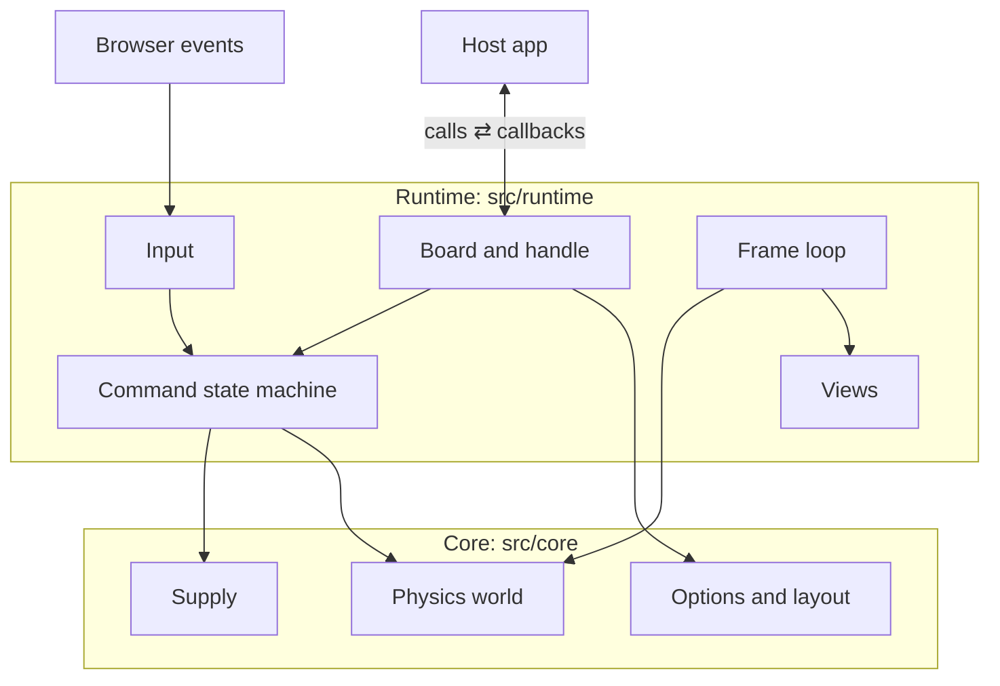

# Structure

## Entry points

| Entry | What it is |
|---|---|
| `plinko-config` | `createPlinko()` and the types. No side effects on import. |
| `plinko-config/element` | The `<plinko-board>` custom element, a thin wrapper around `createPlinko()`. Registers the tag on import. |

Each entry has a size budget, checked by `npm run check` (size-limit, brotli).

## Two layers

The source is split into two layers. **Core** (`src/core/`) is pure TypeScript: options, layout, physics, and the chip supply, with no DOM and no timers. **Runtime** (`src/runtime/`) owns everything that touches the browser: the DOM, input, timing, drawing, announcements, and host callbacks. Runtime imports core; core never imports runtime. See [Rules](./rules#_1-core-never-imports-runtime).

Arrows are calls. What comes back (notices from the state machine, events from the physics world) is on [Data flow](./data-flow).

## Modules

### Core

| Module | Responsible for | Never |
|---|---|---|
| `options.ts`, `validate.ts` | Resolving and validating core options (`slots`, `chips`, `board`, `physics`) | Touch the DOM |
| `layout.ts` | Pegs, walls, rails, and floor, in board units | Know about chips |
| `world.ts` | Moving and colliding chips, deciding when they rest and where, piles, a full board. See [Physics](./physics). | Know about the supply, the DOM, or callbacks |
| `supply.ts` | Chip counts, reservations, refill caps (unlimited is `Infinity`) | Use timers or storage |
| `rng.ts` | Seeded random numbers (mulberry32) | |
| `vendor/littlejs/` | Vector and collision math, vendored unchanged from LittleJS | |

### Runtime

| Module | Responsible for | Never |
|---|---|---|
| `board.ts`, `assemble.ts` | `createPlinko()`: building a board's parts and wiring them together | |
| `context.ts` | The state one board's parts share, and `callHost()` for calling host callbacks safely | |
| `handle.ts`, `update.ts` | The public handle, `update()`, and `destroy()` | |
| `commands.ts` | The command state machine: the only code that changes the held chip | Read the DOM or keys |
| `notices.ts` | Acting on the machine's notices: announcements and callbacks | |
| `input/` | Turning keys and pointer gestures into actions, applied through `perform.ts` | Change state directly |
| `loop.ts`, `frame.ts` | The frame loop and what it does each frame. See [Frame loop](./frame-loop). | Know about chips (`loop.ts`) |
| `world-events.ts` | Acting on physics events: callbacks, announcements, settling `drop()` promises | |
| `supply.ts`, `lock.ts` | Reporting chip counts, interval refills, requests to the host, locking the board | Count chips itself |
| `sizing.ts`, `observe.ts` | Fitting the board, and watching size and visibility. See [Sizing internals](./sizing). | |
| `motion.ts` | The `motion` option and the visitor's reduced-motion setting | |
| `config.ts`, `labels.ts`, `theme.ts`, `look.ts`, `styles.ts` | Runtime options: labels, colors, fonts, per-slot and per-chip styles | |
| `view/canvas.ts`, `view/geometry.ts`, `view/slot-labels.ts` | Drawing the board, tray, chips, and slot labels | Change state |
| `view/dom.ts` | The wrapper and its few DOM nodes | Change state |
| `view/a11y.ts` | The live region announcements are spoken through | Decide when something happened |
| `element.ts` | `<plinko-board>`: mounting, updating, and remounting, and firing callbacks as events | |
| `dispatch.ts` | Typed handler maps, so every message type must have a handler | |
