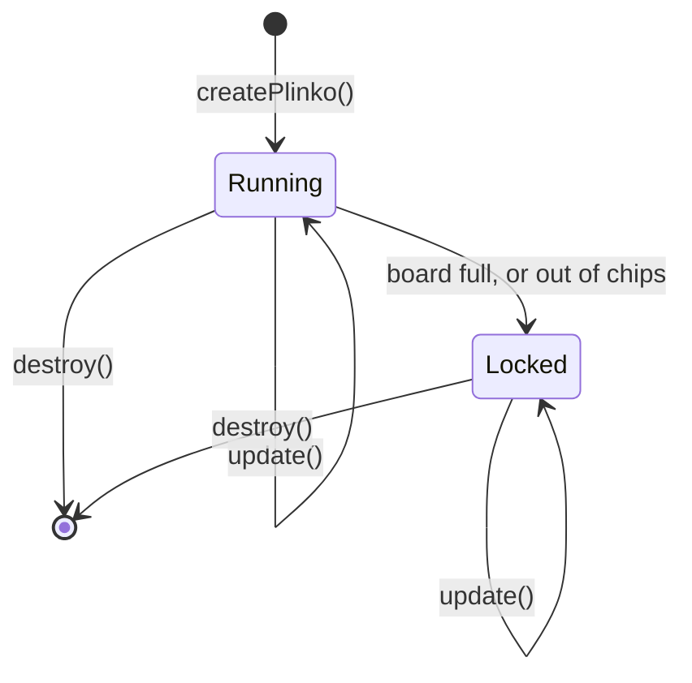

# Board lifecycle

`createPlinko()` mounts a board and returns a handle. The board runs until `destroy()`. While it runs, `update()` changes its options. When it fills up or runs out of chips for good, it locks: it stays on screen, but nothing more can be dropped.

## Mount

`createPlinko(target, options)` runs synchronously, and the board is ready when it returns. There's nothing to load.

1. It finds the target: an element, or the first match for a CSS selector.
2. It validates every option. An invalid option throws a `PlinkoConfigError` that names the problem, before anything is added to the page.
3. It appends one wrapper element inside the target, holding the canvas, the screen-reader text, and the attribution link (if `attribution` is on).
4. It starts listening for keys and pointer input on the canvas, watches the wrapper's size and visibility, follows the visitor's reduced-motion setting (with `motion: 'auto'`), and starts the refill timer (with interval refills).
5. It sizes the board to the target and draws it. See [Sizing](../contracts/sizing).
6. It reports the starting chip counts through `onSupplyChange`. If there are no chips at all and they never refill, the board locks straight away.

To restore chip counts from an earlier visit, pass them as each chip's `count`. See [Chip supply](../guide/chip-supply#keeping-counts-across-page-loads).

## Update

`board.update(options)` changes options on a running board. Options you leave out keep their values, and an option set to `undefined` goes back to its default.

These options shape the board itself, so they can only be set at mount: `slots`, `chips`, `board`, `physics`, `supply`, and `attribution`. Passing any of them to `update()` throws a `PlinkoConfigError`. To change them, destroy the board and create a new one. The new board starts with empty piles.

Everything else can be updated: callbacks, `labels`, `theme`, per-slot and per-chip styles, `slotLabels`, `motion`, `keys`, step sizes, `autoReload`, and `maxInFlight`. `update()` validates the whole update first, so an invalid value changes nothing. A change to the theme, styles, or slot labels refits and redraws the board. Callbacks and labels take effect from the next event on.

`board.keySteps()` reports the step sizes the arrow keys use, with defaults filled in. The default up and down steps are one and four peg rows, so they change when the slot label layout or the board's size moves the drop zone.

## Pause

`board.pause()` freezes the simulation and drawing, and `board.resume()` continues. The board also pauses by itself while it's scrolled out of view. Chips in flight stop where they are and carry on when it resumes.

## Lock

A board locks for good when one of these happens first:

| Reason | When |
|---|---|
| `slots` | Every slot's pile reaches the tops of its rails. |
| `overflow` | A chip comes to rest touching the drop line. |
| `exhausted` | Every kind has no chips left, none is held, and the refill mode is `never`. |

`onFull` fires once, with that reason. A held chip goes back to the tray, and chips already in flight finish falling. The announcer reports their landings, then that the board is locked. From then on, pickups are refused, `drop()` rejects, and requests for more chips are denied without asking your code.

A locked board still takes `update()` and still shows its piles.

## Destroy

`board.destroy()` removes everything the board added: the wrapper and everything in it, every listener and observer, the refill timer, and the frame loop. A held chip's reservation is released. `drop()` promises that are still waiting resolve, since their chips are gone, and answers to pending chip requests are ignored. Calling `destroy()` again does nothing.

The target element itself is left as it was.

## `<plinko-board>`

The custom element manages this lifecycle for you. It mounts the board, inside its own shadow root, once it's in the document and has `options`, and destroys it when it's removed. Setting `options` again calls `update()`, or destroys and remounts the board if a mount-only option changed.

Mount-only options are compared by value, not by identity. Frameworks often build a new options object on every render, and comparing by identity would remount the board, and empty its piles, every time. See [Frameworks](../guide/frameworks#web-component).
