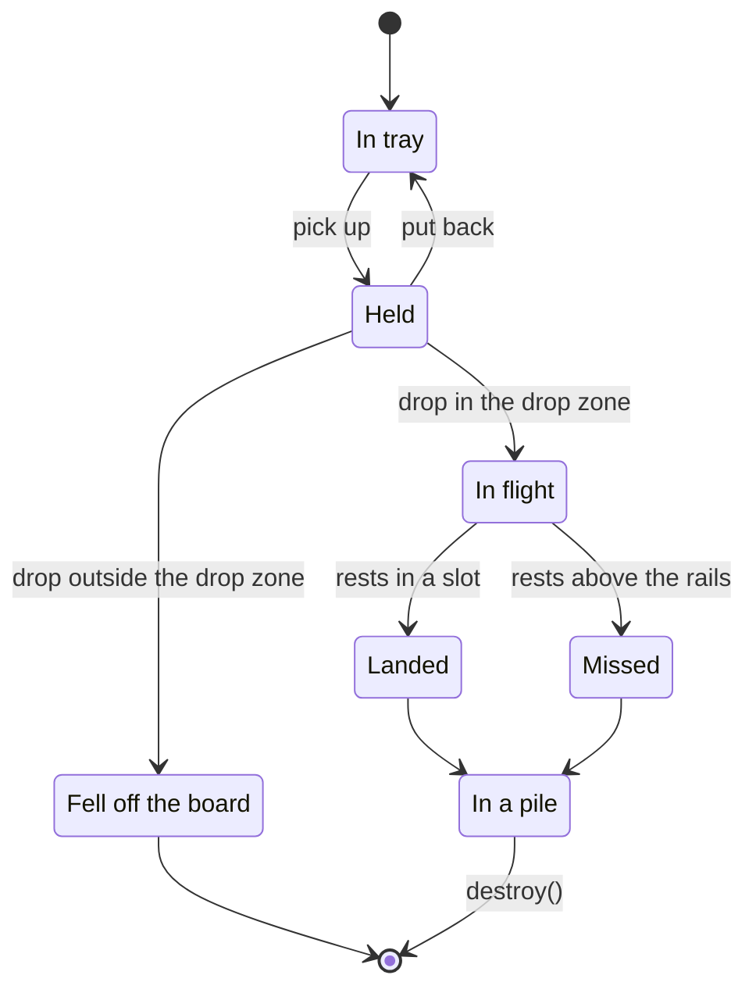
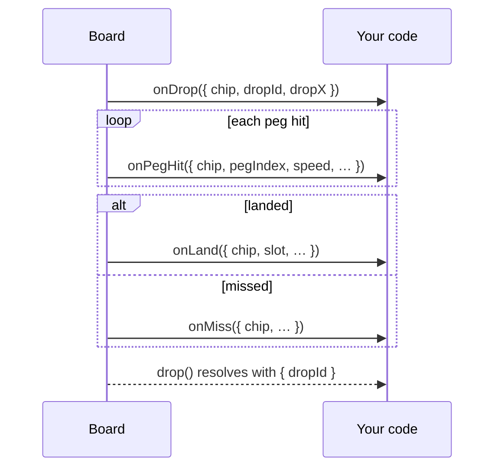

# Chip lifecycle

A chip starts in the tray. A visitor picks it up, carries it into the drop zone, and drops it. It falls through the pegs and comes to rest in a pile, either in a slot (a landing) or on top of a pile above the rails (a miss). A chip dropped outside the drop zone falls off the board.

## In the tray

The tray shows each chip kind and how many are left. Picking one up reserves it: from then on it counts as used, and `onSupplyChange` reports the lower count. Putting it back returns it.

When a kind has none left, picking it up is refused and announced. If the refill mode is `onRequest`, the tray offers to request more instead. See [Chip supply](../guide/chip-supply).

## Held

A board holds at most one chip at a time. The held chip has two positions, both from 0 to 1: `x`, across the board, and `lift`, from the tray (0) up to the drop line (1). It starts in the tray and has to be carried up into the **drop zone**, the band above the first row of pegs, before it can be dropped. While a chip is held, the drop zone is outlined; while the chip is inside it, the zone is lit.

Visitors carry the chip with the keyboard or by dragging; see [Accessibility](../guide/accessibility#keyboard) for the controls. Your code uses the handle instead: `pickUp(kind)`, `aim(x)`, and `cancel()`.

## Dropping

A chip dropped inside the drop zone starts falling, and `onDrop` fires. A board allows `maxInFlight` chips in flight at once. A drop past that limit is refused and announced, and the chip stays held.

With `autoReload` on, a keyboard drop picks up the next chip of the same kind, at the same position, so a visitor can drop several in a row. A drag doesn't reload, because the finger or mouse button has already let go.

`board.drop()` carries the chip straight into the drop zone, picking it up first if nothing is held, and returns a promise. The promise rejects if the drop is refused.

## Falling off the board

A chip dropped outside the drop zone, or a drag released anywhere other than the tray or the drop zone, falls off the bottom of the board. With reduced motion, it fades out instead. The chip is spent: `onSupplyChange` reports it, and the announcer says it fell off. `onDrop`, `onLand`, and `onMiss` don't fire, and it never reloads.

Only visitors can lose chips this way. `board.drop()` always reaches the drop zone.

## In flight

The chip falls under gravity and bounces off pegs, walls, and other chips. Each peg it hits fires `onPegHit`. Every drop has a seed, reported in `onLand` and `onMiss`. Passing the same seed and `x` to `board.drop()` replays the same fall, as long as no other chip is in flight.

Any number of chips can be in flight, up to `maxInFlight`, while the next one is held.

## Landed or missed

A chip that comes to rest with any part below the tops of the slot rails has **landed**. The slot comes from where it actually ends up, so a chip that rolls off an overflowing pile into the next slot reports that slot. `onLand` fires with the chip and the slot.

Any other chip that comes to rest has **missed**: it sits on top of a pile that already reaches above the rails, it stays stuck after the board has nudged it three times, or it's still in flight after 60 seconds. `onMiss` fires, and `onLand` doesn't, so every `onLand` is a real slot result.

## In a pile

Landed and missed chips stay where they are, and later chips stack on top of them. Piles last until `destroy()`. When a pile rises above its rails, new chips roll over into the neighbouring slots.

The board is **full** when every slot's pile reaches the rail tops, or when a chip comes to rest touching the drop line. `onFull` fires once, the board locks, and a held chip goes back to the tray. Chips already in flight finish falling. After that, every pickup and drop is refused.

## Callback order

For each drop, the callbacks fire in this order:

The `drop()` promise only says the chip is no longer in flight. The outcome comes from `onLand` or `onMiss`, which carry the same `dropId`.

With reduced motion, a chip in flight comes to rest on the next frame, using the same physics steps as the animated fall. The callbacks fire in the same order, and a seeded drop lands in the same slot.
